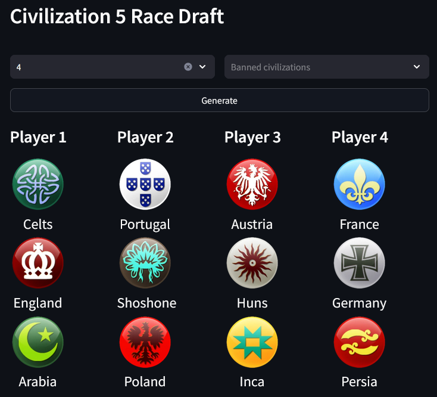

<!-- PROJECT NAME -->
 

    <h3 align="center">Civilization 5 Race draft Tool</h3>
    

        A web application that let you generate random race choices for up to 8 people.
    

  
Table of contents

- [About The Project](#about-the-project)
- [Getting Started](#getting-started)

<!-- ABOUT THE PROJECT -->
## About The Project

This application is designed to help you generate random race picks for selected number of players.
There is an option to ban selected races, but be aware that if you'll ban too many an error will appear that there is not enough to generate choices.

<!-- GETTING STARTED -->
## Getting Started

1. Clone repository.
2. Install requirements.
3. Run streamlit application.
